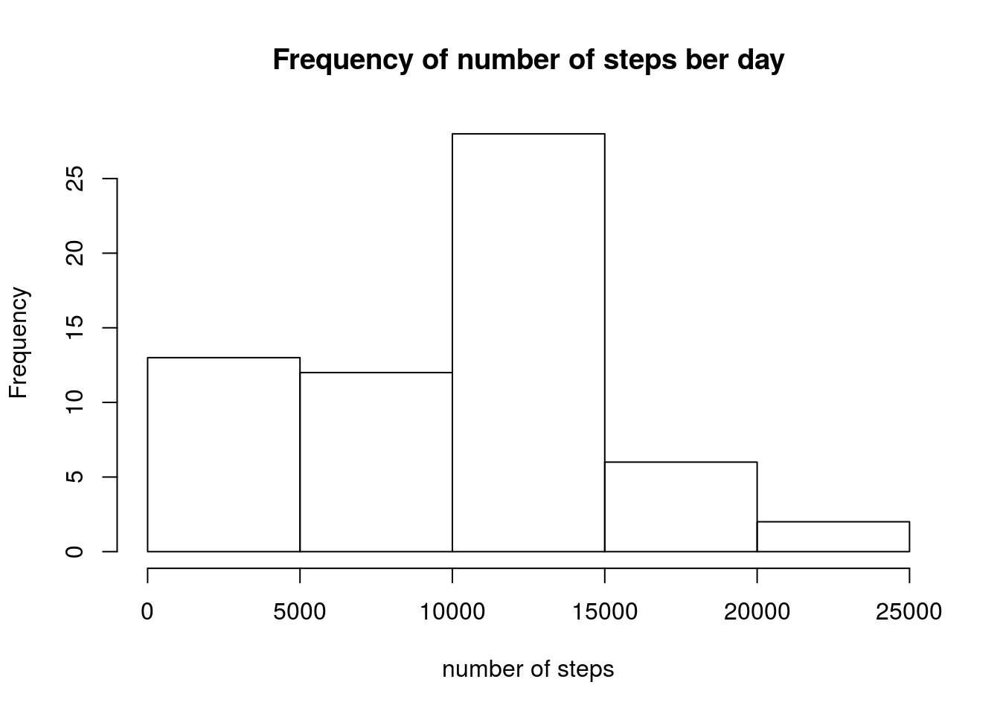
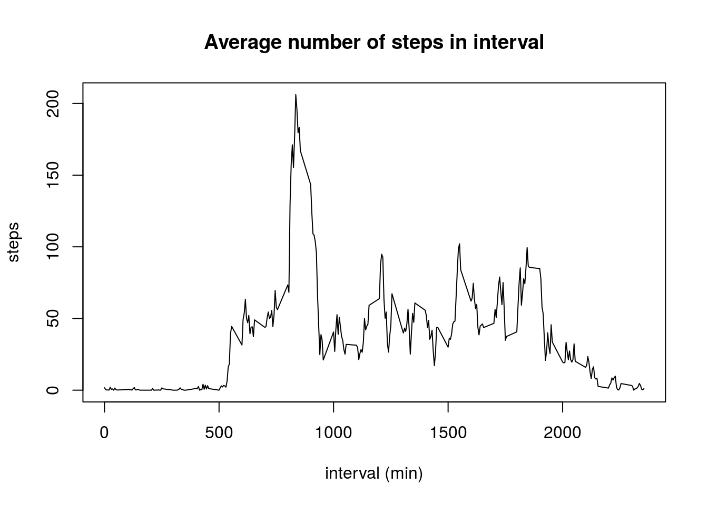
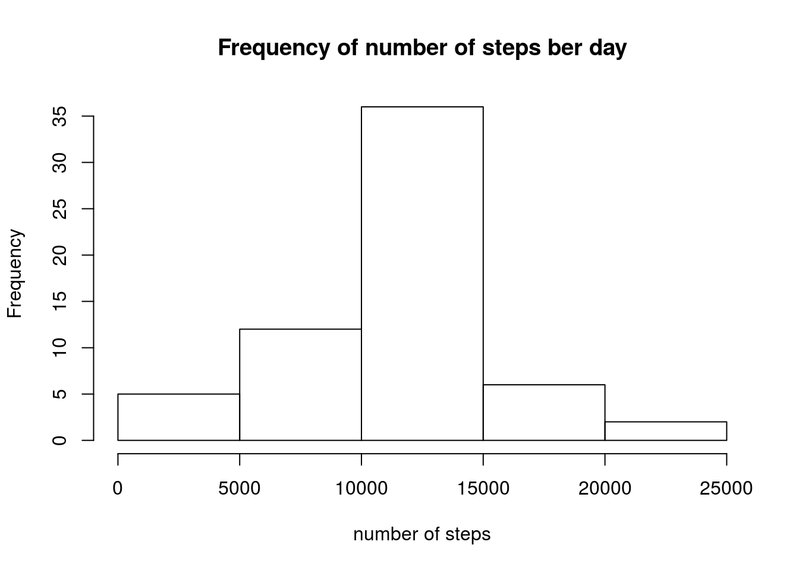
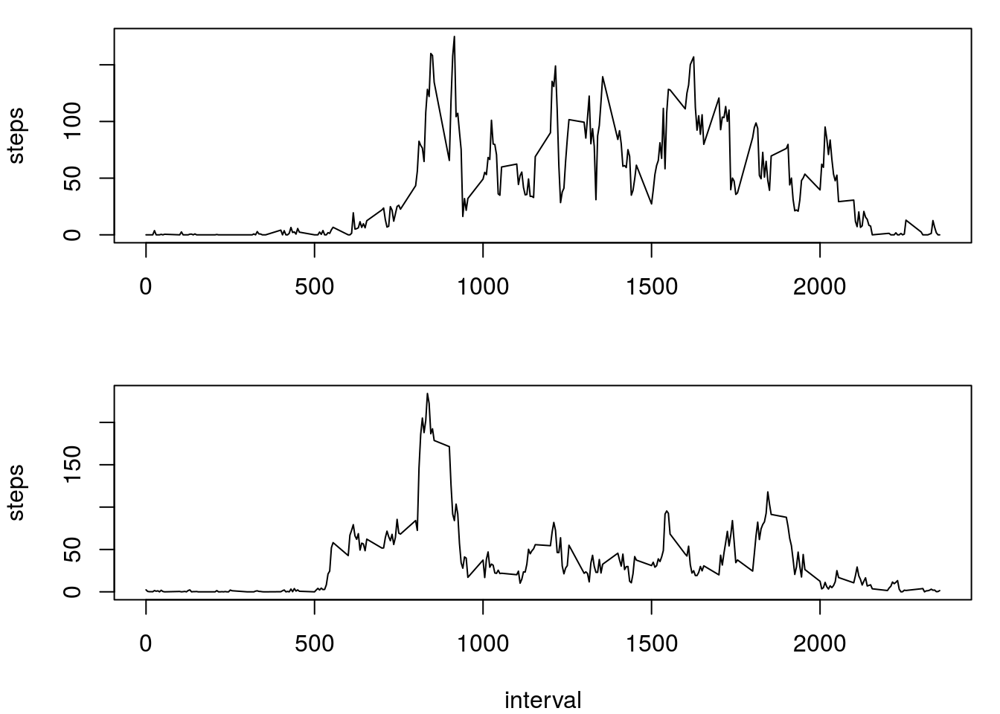

## Loading and preprocessing the data

Data is read from file, steps are transformed to numeric:


```r
#readout
data <- read.csv("activity.csv")

#to numeric
data$steps <- as.numeric(data$steps)
```

## What is mean total number of steps taken per day?

First we aggregate data and create histogram:


```r
#agregating
daily_sum <- aggregate(data$steps, by=list(data$date), FUN='sum', na.rm=TRUE)

#histogram
hist(daily_sum$x, xlab="number of steps", main="Frequency of number of steps ber day")
```



We procede by taking mean:


```r
#mean
mean(daily_sum$x)
```

```
## [1] 9354.23
```

and than median:


```r
#median
median(daily_sum$x)
```

```
## [1] 10395
```

## What is the average daily activity pattern?

We agregate and plot data:


```r
#aggregate
interval_mean <- aggregate(data$steps, by=list(data$interval), FUN='mean', na.rm=TRUE)

#plot
plot(interval_mean$Group.1, interval_mean$x, xlab='interval (min)', ylab='steps', main='Average number of steps in interval', type='l')
```



Finding interval with most steps taken on average:


```r
interval_mean[which(interval_mean$x==max(interval_mean$x)),1]
```

```
## [1] 835
```

This is at 13:55 - 14:00.

## Imputing missing values

To count rows with Na in original dataset we use:


```r
nrow(na.omit(data))
```

```
## [1] 15264
```

Wherever data is missing we'll fill it with mean for interval:


```r
interpolated_data <- data
missing_intervals <- interpolated_data[is.na(interpolated_data$steps),3]
missing_steps <- sapply(missing_intervals, function(x) { interval_mean[interval_mean$Group.1==x,2] })
interpolated_data[is.na(interpolated_data$steps),1] <- missing_steps
```

We calculate new histogram:


```r
#agregating
daily_sum <- aggregate(interpolated_data$steps, by=list(interpolated_data$date), FUN='sum', na.rm=TRUE)

#histogram
hist(daily_sum$x, xlab="number of steps", main="Frequency of number of steps ber day")
```



We procede by taking new mean:


```r
#mean
mean(daily_sum$x)
```

```
## [1] 10766.19
```

and than new median:


```r
#median
median(daily_sum$x)
```

```
## [1] 10766.19
```

Both median and mean are higher now.

## Are there differences in activity patterns between weekdays and weekends?

Creating new variable in data


```r
data$weekend[weekdays(as.Date(data$date)) == "Sunday" | weekdays(as.Date(data$date)) == "Saturday"] <- 'weekend'
data$weekend[!(weekdays(as.Date(data$date)) == "Sunday" | weekdays(as.Date(data$date)) == "Saturday")] <- 'weekday'
data$weekend <- as.factor(data$weekend)
```

Creating panel plot


```r
interval_mean_weekend <- aggregate(data$steps[data$weekend=='weekend'], by=list(data$interval[data$weekend=='weekend']), FUN='mean', na.rm=TRUE)
interval_mean_weekday <- aggregate(data$steps[data$weekend=='weekday'], by=list(data$interval[data$weekend=='weekday']), FUN='mean', na.rm=TRUE)

par(mfrow=c(2, 1), mar=c(4,4,1,1))

plot(interval_mean_weekend, type='l', xlab='', ylab='steps')
plot(interval_mean_weekday, type='l', xlab='interval', ylab='steps')
```




